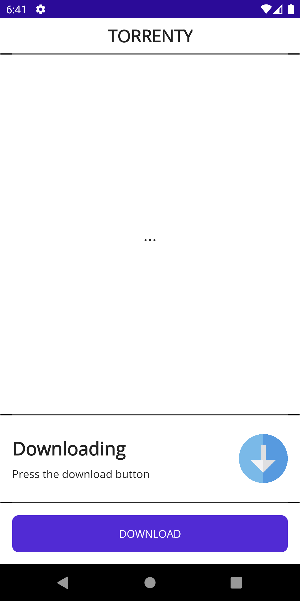
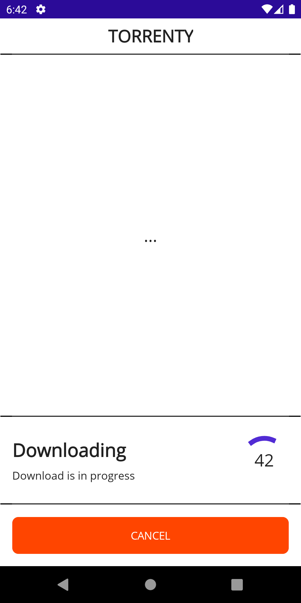
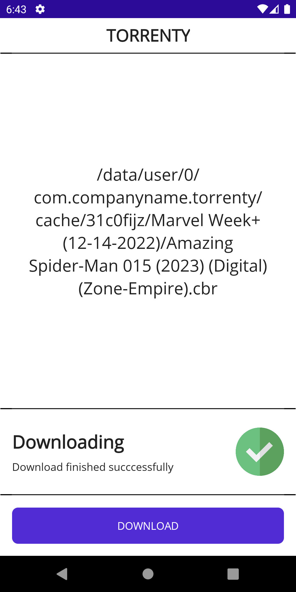
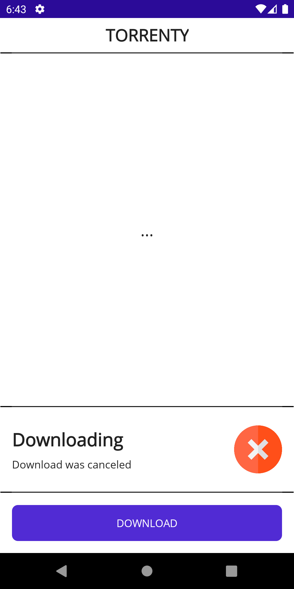

# <samp>TORRENTY</samp>

MAUI application that uses the MonoTorrent package.

## <samp>SUPPORTS</samp>

| <samp>AND</samp> | <samp>IOS</samp> | <samp>LIN</samp> | <samp>MAC</samp> | <samp>WIN</samp> |
| :-: | :-: | :-: | :-: | :-: |
|  🟩   |  🟩   |  🟥   |  🟩   |  🟩   |

## <samp>OVERVIEW</samp>

